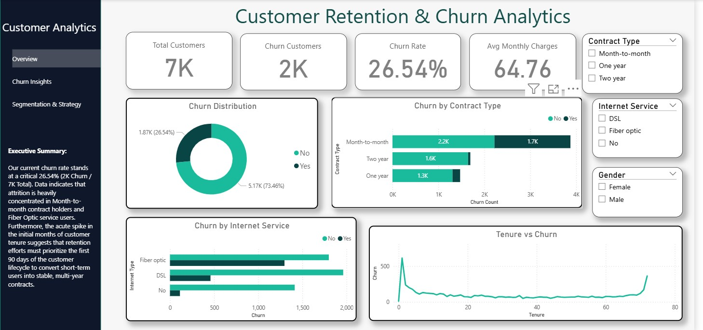

# Customer Retention & Churn Analytics Dashboard

## Project Overview

This project analyzes customer churn patterns using the IBM Telco Customer Churn dataset and presents key business insights through an interactive Power BI dashboard.

The objective of the analysis is to identify the factors influencing customer churn, understand customer retention behavior, and provide actionable recommendations that can help organizations improve customer loyalty and reduce churn rates.

---

## Business Problem

Customer churn directly impacts revenue, customer lifetime value, and business growth. Understanding why customers leave is essential for developing effective retention strategies.

This project aims to answer the following questions:

* Which customer segments are most likely to churn?
* How do contract types influence customer retention?
* Does internet service type impact churn behavior?
* How do monthly charges affect customer attrition?
* Which customer groups should be prioritized for retention initiatives?

---

## Dataset Information

Dataset: IBM Telco Customer Churn Dataset

The dataset contains customer demographic information, subscription details, service usage patterns, billing information, and churn status.

### Key Features

* Customer Demographics

  * Gender
  * Senior Citizen
  * Partner
  * Dependents

* Subscription Information

  * Contract Type
  * Tenure
  * Payment Method
  * Paperless Billing

* Service Usage

  * Internet Service
  * Phone Service
  * Online Security
  * Tech Support
  * Streaming TV
  * Streaming Movies

* Financial Metrics

  * Monthly Charges
  * Total Charges

* Target Variable

  * Churn (Yes / No)

---

## Project Workflow

### 1. Data Cleaning & Preparation

* Checked for missing values
* Handled null values in TotalCharges
* Removed duplicate records
* Corrected data types
* Created additional analytical features:

  * Tenure Groups
  * Monthly Charge Groups

### 2. Exploratory Data Analysis (EDA)

Performed detailed analysis to understand:

* Customer demographics
* Churn distribution
* Contract type impact
* Internet service impact
* Monthly charges vs churn
* Tenure vs churn
* Customer retention patterns

### 3. Dashboard Development

Developed a multi-page interactive Power BI dashboard consisting of:

#### Executive Summary

Provides a high-level overview of customer churn metrics and retention performance.

#### Churn Drivers Analysis

Identifies major factors contributing to customer churn.

#### Customer Segmentation & Strategy

Analyzes customer segments and highlights retention opportunities.

---

## Dashboard Features

* Interactive Filters and Slicers
* Multi-Page Navigation
* KPI Cards
* Customer Segmentation Analysis
* Churn Trend Analysis
* Contract-Based Retention Insights
* Service Usage Analysis
* Executive-Level Business Insights

---

## Key Insights

### Contract Type

Customers with month-to-month contracts demonstrate significantly higher churn rates compared to customers with annual and two-year contracts.

### Internet Service

Fiber optic customers exhibit higher churn behavior than DSL customers, indicating potential concerns regarding pricing, service expectations, or customer experience.

### Customer Tenure

Customers with shorter tenure are more likely to churn, highlighting the importance of onboarding and early customer engagement strategies.

### Monthly Charges

Higher monthly charges show a stronger association with churn, suggesting that pricing and perceived value play a significant role in customer retention.

### Customer Support Services

Customers without technical support and online security services tend to churn more frequently than customers using these value-added services.

---

## Business Recommendations

1. Encourage customers to migrate from month-to-month plans to long-term contracts through discounts and loyalty incentives.

2. Strengthen onboarding programs to improve retention among new customers during their early lifecycle.

3. Improve customer support services and promote value-added offerings such as technical support and online security.

4. Implement targeted retention campaigns for high-risk customers with higher monthly charges.

5. Develop personalized retention strategies based on customer behavior and service usage patterns.

---

## Tools & Technologies Used

* Power BI
* Power Query
* DAX
* Python
* Pandas
* Matplotlib
* Seaborn

---

## Files Included

* churn_dashboard.pbix
* cleaned_churn_data.csv
* data_cleaning.ipynb
* churn_eda.ipynb
* README.md

---

## Skills Demonstrated

* Customer Churn Analysis
* Exploratory Data Analysis (EDA)
* Data Cleaning & Preparation
* Power BI Dashboard Development
* DAX Measures
* Business Intelligence
* Customer Retention Analytics
* Data Visualization
* Analytical Storytelling
* Business Recommendation Framework

---

## Future Enhancements

* Predictive Churn Modeling
* Customer Lifetime Value Analysis
* Retention Risk Scoring
* Automated Customer Segmentation

---

## Dashboard

Example:
 
!(Churn_insights.jpg)
!(Segmentation_page.jpg)

## Author

Anshu Shakya

Aspiring Data Analyst | Power BI | SQL | Python | Excel
